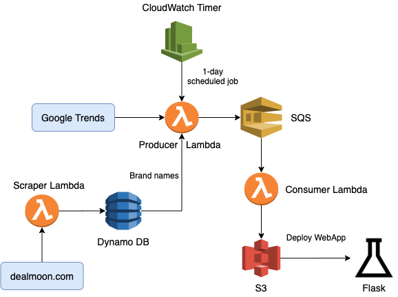

# AWS-BrandTrend-webapp

## Introduction
Welcome to the [**Brand Trend WebApp**](http://trend-flask-env.eba-ubjwp9wg.us-east-1.elasticbeanstalk.com) built by [Michael Tang](http://www.linkedin.com/in/mtang0728) and [Chenxi Wu](https://www.linkedin.com/in/chenxi-wu-107452175/). In this project, we built a simple interface that provides daily trend updates on brands through plots and tables. The brands shown in our webapp are updated on a daily basis and could range from fashion apparels to consumer electronics. The goal is to conduct a simple trend analysis by looking at if a sale would affect the brand's popularity on the web. More specifically, We were inspired by the one of the biggest shopping-guide platform in North America, [Dealmoon](https://www.dealmoon.com/). The website curates tons of the lastest and newest deals across the internet. It also has a product leader board that keep track of the real-time most popular items across the site. These brands are being searched everyday on Google, whose popularity can be quantified and visualized on [Google Trends](https://trends.google.com/trends/). We believe that it would be informative to know the most popular items on Dealmoon as well as the brands' recent search trends, thus to make better purchasing decisions. Please note we are assuming that a brand's popularity could be represented fully by its corresponding Google Trend search result. The webapp is built using Flask application and ran on the principle of a Serverless Data Pipeline, where all functions are implemented using AWS cloud services such as AWS DynamoDB, AWS S3, AWS Lambda, etc. For more detail on the pipeline infrastructure, refer to the ##### below. This project also utilizes continuous integration and deployment (CI/CD), which simplifies the development and change-making process.

## YouTube Link ：
Project Overview: https://youtu.be/N3cTtspmbTk

## Features:
- 100% on Cloud
- Serverless Data Pipeline
- Scalable
- Continuous Integration & Continuous Deployment

## Technology Used:
**Front End**
- HTML
- Flask
- CSS

**Back End**
- AWS CloudWatch Timer
- AWS Lambda
- AWS DynamoDB
- AWS SQS
- AWS S3
- AWS Elastic Beanstalk

## Cloud Architecture
The process and workflow of our project can be summarized in the figure below: 

Note that this repository is responsible for front end operation. More specifically, we use data stored in AWS S3, which are 

For more information on data pipeline and backend operation, please refer to the following repository: [Serverless-Data-Pipeline](https://github.com/MTang0728/Serverless-Data-Pipeline)

### Web-scraping from Dealmoon

There are many sections on Dealmoon that contain useful information. For example the homepage where all the shopping-guide posts are held. After examining each section, we decided to scrape the product leaderboard that records the items that have the most clicks. It is a dynamic webpage in that the content will continue to load once the user scroll down the page. So we used dynamic scraping method to extract the data we need. We built AWS Scraper Lambda function to extract the first 30 records of the leaderboard and save the names of brands in a list. 

### Google Trend API

Google Trends is a website that analyzes the popularity of top search queries in Google Search across various regions and languages. After getting the real-time most popular items/brands from Dealmoon, we pass the brand names as keywords to Google trends via API to get the search trend over the last 1-month. The dataframe is stored in Amazon DynamoDB via Consumer Lambda function. 

### Build Data-pipeline

To make the project in continuous-delivery, we set the the timespan to be 1-day, which means the DynomoDB will update every 1 day. 

This data pipeline porcesses are implemented with AWS Lambda, which are store in a backend repository: 

