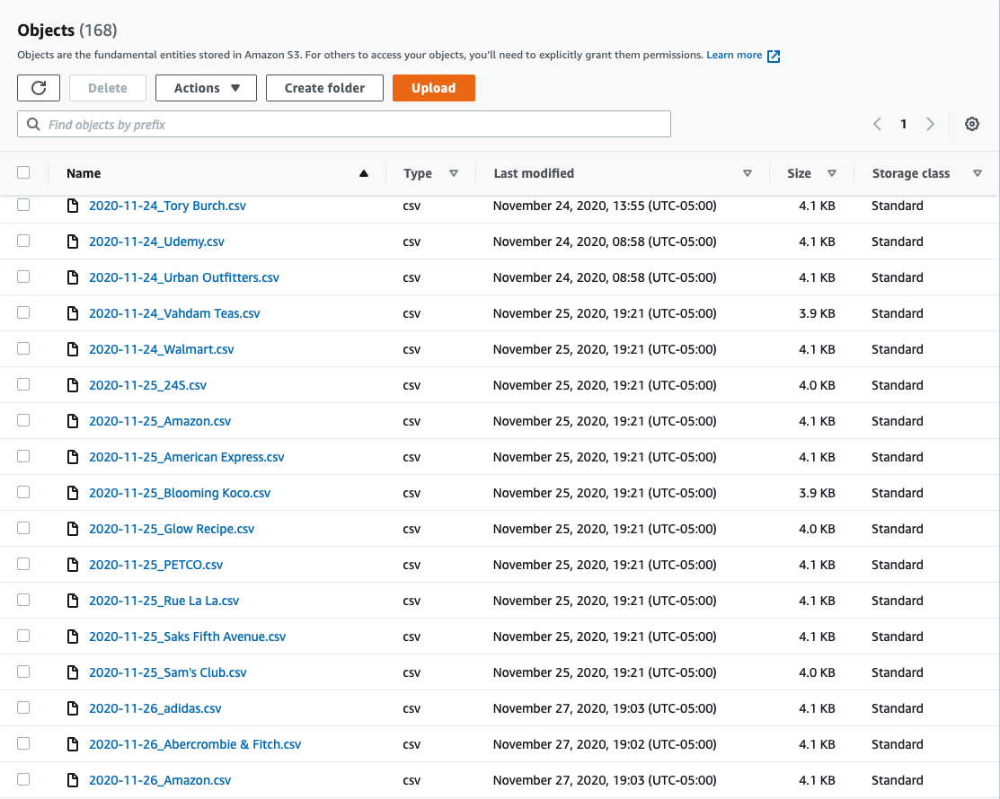

# AWS-BrandTrend-webapp

## Introduction
Welcome to the [**Brand Trend WebApp**](http://trend-flask-env.eba-ubjwp9wg.us-east-1.elasticbeanstalk.com) built by [Michael Tang](http://www.linkedin.com/in/mtang0728) and [Chenxi Wu](https://www.linkedin.com/in/chenxi-wu-107452175/). In this project, we built a simple interface that provides daily trend updates on brands through plots and tables. The brands shown in our webapp are updated on a daily basis and could range from fashion apparels to consumer electronics. The goal is to conduct a simple trend analysis by looking at if a sale would affect the brand's popularity on the web. More specifically, We were inspired by the one of the biggest shopping-guide platform in North America, [Dealmoon](https://www.dealmoon.com/). The website curates tons of the lastest and newest deals across the internet. It also has a product leader board that keep track of the real-time most popular items across the site. These brands are being searched everyday on Google, whose popularity can be quantified and visualized on [Google Trends](https://trends.google.com/trends/). We believe that it would be informative to know the most popular items on Dealmoon as well as the brands' recent search trends, thus to make better purchasing decisions. Please note we are assuming that a brand's popularity could be represented fully by its corresponding Google Trend search result. The webapp is built using Flask application and ran on the principle of a Serverless Data Pipeline, where all functions are implemented using AWS cloud services such as AWS DynamoDB, AWS S3, AWS Lambda, etc. For more detail on the pipeline infrastructure, refer to the Cloud Architecture section below. This project also utilizes continuous integration and deployment (CI/CD), which simplifies the development and change-making process.

## YouTube Link ：
Project Overview: https://youtu.be/N3cTtspmbTk

## Features:
- 100% on Cloud
- Serverless Data ETL & Pipeline
- Cutstomizable & Scalable
- Continuous Integration & Continuous Deployment

## Technology Used:
**Front End**
- HTML
- Flask
- CSS

**Back End**
- AWS CloudWatch Timer
- AWS Lambda
- AWS DynamoDB
- AWS SQS 
- AWS S3
- AWS Elastic Beanstalk
- AWS CodeBuild
- AWS CodePipeline

## Cloud Architecture：
The process and workflow of our project can be summarized in the figure below: 

Note that this repository only contains source codes for the **Front End** operation, which is based on data stored in AWS S3. More specifically, each piece of data in our S3 represents the trend for a particular brand on a particular day. This is illustrated in the figure below:

Depending on the time, different data are selected to perform simple trend analysis through plots and tables. This analysis is constructed on a Flask application, which is a popular web framework for Python and runs on a local server. The webapp is then deployed with AWS Elastic Beanstalk to bring it online.

Finally, CodePipeline is used to streamline the deployment process - Any commits to this GitHub repository would trigger this pipeline to rebuild and deploy the webapp automatically. 

The **Back End** operation involves the following high-level processes:

- web-scraping from Dealmoon.com
- Data ETL through AWS DynamoDB, AWS SQS, AWS S3
- Trend collection using Google Trend API
- Data Integration with AWS Lambda & AWS CloudWatch Timer.

For details on data pipeline and backend operation, please refer to the following repository: [Serverless-Data-Pipeline](https://github.com/MTang0728/Serverless-Data-Pipeline)
