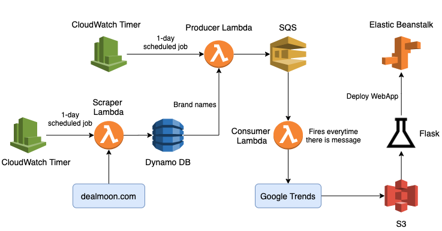

# AWS-BrandTrend-webapp

## Introduction
Welcome to the [**Brand Trend WebApp**](http://trend-flask-env.eba-ubjwp9wg.us-east-1.elasticbeanstalk.com) built by Michael Tang and [Chenxi Wu](https://www.linkedin.com/in/chenxi-wu-107452175/). In this project, we built a simple interface that provides daily trend updates on brands through plots and tables. The brands shown in our webapp are updated on a daily basis and could range from fashion apparels to consumer electronics. The goal is to conduct a simple trend analysis by looking at if a sale would affect the brand's popularity on the web. Note: we are assuming that a brand's popularity can be represented by it corresponding Google Trend search result. The webapp is buil using Flas applicatio and ran on the principle of a Serverless Data Pipeline, where all functions are implemented using AWS cloud services. We also include continuous integratio an deployment (CI/CD), which simplifies the development and change-making process.

We built an integrated data pipeline as well as an interactive WebApp to display our result. The main tools we used are Amazon DynamoDB, SQS AWS S3 buckets and Flask. 

We were inspired by the biggest Chinese shopping-guide platform in North America, [Dealmoon](https://www.dealmoon.com/). The website hosts tons of posts that share the newest deal information across the internet. It also has a product leader board that records the real-time most popular items across the site. These brands are being searched everyday on Google, where [Google trends](https://trends.google.com/trends/) keeps the record of these searches. It would be informative to know the most popular items on Dealmoon as well as the search trend of this brand recently, thus to make better decision on what to buy. 

## Webapp Demo ：
[YouTube Link](https://youtu.be/N3cTtspmbTk)

## Flowchart
The process and flowchart of building this project can be summarized as below. 

### Web-scraping from Dealmoon

There are many sections on Dealmoon that contain useful information. For example the homepage where all the shopping-guide posts are held. After examining each section, we decided to scrape the product leaderboard that records the items that have the most clicks. It is a dynamic webpage in that the content will continue to load once the user scroll down the page. So we used dynamic scraping method to extract the data we need. We built AWS Scraper Lambda function to extract the first 30 records of the leaderboard and save the names of brands in a list. 

### Get Google trends

Google Trends is a website that analyzes the popularity of top search queries in Google Search across various regions and languages. After getting the real-time most popular items/brands from Dealmoon, we pass the brand names as keywords to Google trends via API to get the search trend over the last 1-month. The dataframe is stored in Amazon DynamoDB via Consumer Lambda function. 

### Build Data-pipeline

To make the project in continuous-delivery, we set the the timespan to be 1-day, which means the DynomoDB will update every 1 day. 

This data pipeline porcesses are implemented with AWS Lambda, which are store in a backend repository: [Serverless-Data-Pipeline](https://github.com/MTang0728/Serverless-Data-Pipeline)

